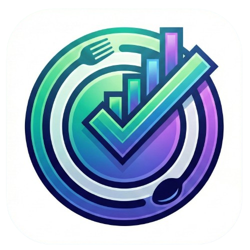

# Meal Manager - Hostel & Shared Living Management System



## 🚀 Overview
**Meal Manager** is an open-source, full-stack application designed to streamline meal planning, expense tracking, and accounting for hostels, mess halls, and shared living spaces. Built with efficiency and transparency in mind, it automates the complex calculations of daily meal rates, monthly balances, and deposit management.

## ✨ Key Features
- **📊 Dashboard**: Real-time overview of personal balance, daily meal consumption, and system stats.
- **🍛 Meal Management**: 
    - Daily Lunch/Dinner toggle.
    - Automated cutoff times (lock meals after a certain hour).
    - "Guest Meal" support (Count > 1).
    - Admin override for past/future dates.
- **💰 Expense Tracking**:
    - Detailed expense logging with unit, quantity, and cost.
    - **Image Uploads**: Receipts/Memos via Vercel Blob (optimized with Sharp).
    - Auto-calculation of daily meal rates based on monthly expenses.
- **💳 Accounting System**:
    - **Dual-Rate Calculation**: Dynamic rates for current month vs. fixed rates for past months.
    - **Monthly Snapshots**: Auto-freezing of financial data at month-end to preserve history.
    - **Wallet System**: Deposit requests with Admin approval workflow.
- **📱 Mobile Optimized**: Fully responsive UI + Capacitor support for Android APK generation.
- **🛡️ Role-Based Access**: Admin and Member roles with protected routes (via Middleware).

## 🛠️ Tech Stack
- **Framework**: [Next.js 16](https://nextjs.org/) (App Router, Server Actions)
- **Database**: [PostgreSQL](https://www.postgresql.org/) (via [Supabase](https://supabase.com/))
- **ORM**: [Prisma](https://www.prisma.io/)
- **Auth**: [Auth.js (NextAuth v5)](https://authjs.dev/)
- **Styling**: [Tailwind CSS](https://tailwindcss.com/)
- **Storage**: [Vercel Blob](https://vercel.com/docs/storage/vercel-blob)

## 🚀 Getting Started

### Prerequisites
- Node.js 18+
- A Supabase Project (PostgreSQL)

### Installation

1. **Clone the repository**
   ```bash
   git clone https://github.com/haseebafeef/meal-manager.git
   cd meal-manager
   ```

2. **Install dependencies**
   ```bash
   npm install
   ```

3. **Configure Environment**
   Create a `.env` file in the root directory:
   ```env
   # Database (Supabase)
   DATABASE_URL="postgres://[user]:[password]@[host]:6543/postgres?pgbouncer=true"
   DIRECT_URL="postgres://[user]:[password]@[host]:5432/postgres"

   # Auth (NextAuth)
   AUTH_SECRET="your-generated-secret" # Generate with: npx auth secret
   AUTH_URL="http://localhost:3000"

   # Google Auth (Optional)
   GOOGLE_CLIENT_ID="your-google-client-id"
   GOOGLE_CLIENT_SECRET="your-google-client-secret"

   # Email Service (For Password Reset)
   GMAIL_USER="your-email@gmail.com"
   GMAIL_APP_PASSWORD="your-app-password"
   NEXT_PUBLIC_BASE_URL="http://localhost:3000"

   # Blob Storage (Vercel)
   BLOB_READ_WRITE_TOKEN="your-vercel-blob-token"
   ```

4. **Initialize Database**
   ```bash
   npx prisma generate
   npx prisma db push
   ```

5. **Run the Development Server**
   ```bash
   npm run dev
   ```
   Open [http://localhost:3000](http://localhost:3000).

## 📱 Mobile Build (Android)
This project uses **Capacitor** to wrap the web app.
```bash
npx cap sync
npx cap open android
```

## 🤝 Contributing
Contributions are welcome! Please fork the repository and submit a Pull Request.

## 📄 License
This project is licensed under the MIT License.
